  
[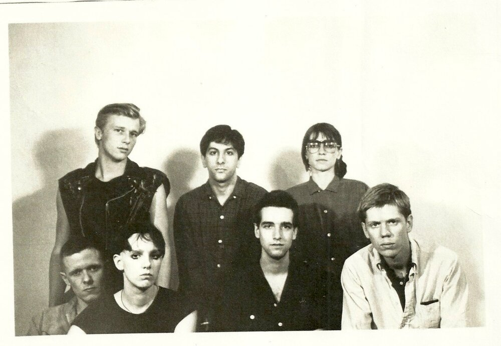](https://www.reddit.com/r/OldSchoolCool/comments/m303cy/members_of_the_bands_that_would_become_sonic/)
  

|      ***No pain, no death, no fear, no hate***
|      ***No time, no now, no suffering***
|      ***No touch, no loss, no hand, no sense***
|      ***No wound, no waste, no lust, no fear***
|      ***No mind, no greed, no suffering***
|      ***No thought, no hurt, no hands to reach***
|      ***No knife, no words, no lie, no cure***
|      ***No need, no hate, no will, no speech***
|      (From the Swans song [*Screen Shot*)](https://www.youtube.com/watch?v=6qDq9eGUmMI)
  

|      ***Can you please pass me a jug of winter light?***
|      ***Fold me in an ocean's whim?***
|      ***In sweet corrosive fire light?***
|      ***In the city made of tin?***
|      ***Are you famous under the skin?***
|      ***Familiar with the things you wanted?***
|      ***Able now to take it all in?***
|      ***Making peace with every hole in the story?***
|      (From the Sonic Youth song [*NYC Ghosts & Flowers*)](https://www.youtube.com/watch?v=bqnkMEnU0iI)

    
The NYC no wave/noise rock/post punk bands **Sonic Youth** and **Swans** are not
only known for their eccentric and hypnotic noise landscapes but equally well for
their intricate lyrics. While Sonic Youth's lyrics are deeply rooted in the tradition-less tradition of
modern American poetry, listening to Swans often is reminiscent of going to a church of sonic uproar when singer Michael Gira recites his ecclesiastical texts in their maelstrom of tumultuous music. What both bands share is their love for __repetition and noise__.

Here, I will take a deep dive into the words of each of the two bands' 15 studio
records between 1983 and 2019 and provide different perspectives on some features of their lyrical craft. We'll see some (uncanny) commonalities and defining differences. Some of the questions I try to answer include:

- How many words do they use on each record and in each of their songs?
- Which words do they use often and which words appear in many songs?
- Which words occur together?
- How repetitive are the two bands? Has this changed over the years?
- How negative are their lyrics? Has this changed over the years?
- Can we teach a computer to differentiate between the two bands?
- Can a computer write lyrics in their style for us?

If you're interested in the __code of this project__, have a look [here](https://github.com/dmnkfr/sonic_youth/blob/main/sy_swans.Rmd).

So, let's get started. 

[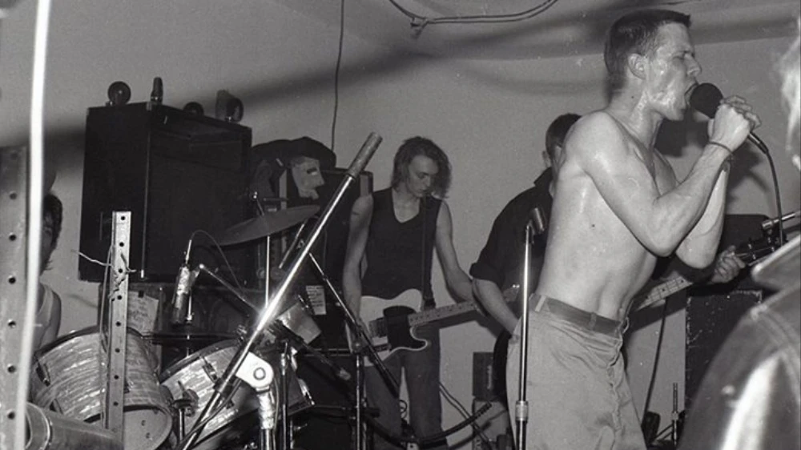](https://www.vice.com/sv/article/rjyng6/swans-filth-reissue-interview)

    

I'll get the lyrics from __Genius' API__. You need a Genius account and
create an API client on <https://genius.com/api-clients> for this.

    

So, we got 4602 lines of poetry from __149 Sonic Youth songs__ and 4407 lines of prayers from __146 Swans songs__. Let's see how many songs there are on each of the studio records.

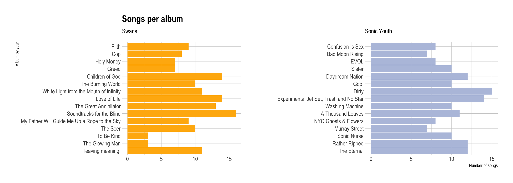

    
__Arrrrghrghrgrhgr!__ For reasons still unknown, we got lyrics for only 3/10 songs from "To Be Kind" and only 3/8 from "The Glowing Man". But okej, we'll take what we got and start spiraling in.

### How many words do they use on each album?
To get an idea of the lyrics we got from each record, let's have a look at how many words they use on each record. Keep in mind that the lyrics of two Swans records didn't load completely, thus, they're a bit shorter than the rest.

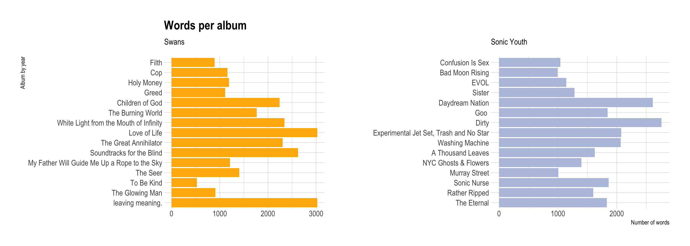
    

From the last two plots, we see that both bands started with fewer songs on their first few records and - as success kicked in - the records got longer and so did the lyrics. Let's look at how long their lyrics are per song.

### How many words are there in each song?

Here's a quick and dirty count of unique words per song. We exclude all the la la la's and uh uh uh's. The longest and shortest lyrics of each band are highlighted an labeled.

    

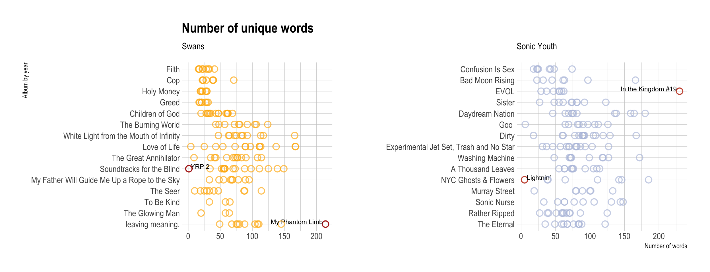

    

|          ***AAAAH*** 
|          ***AAAAH*** 
|          ***AAAAH***
|          ***AAAAH***
|          ***AAAAH***
|          ***AAAAH***
|          ***AAAAH***
|          (From the Swans song [*YRP2*)](https://www.youtube.com/watch?v=JxK1WJR8yoo)
 
Doesn't take (m)any words for a shaman to do their job. Brains i/o.

  

|          ***Lightning***
|          ***Lightning strike***
|          ***Lightning strikes***
|          ***Lightning strike me***
|          ***Lightning strikes me***
|          ***Lightning strike me down***
|          ***Lightning strikes me down***
|          (From the Sonic Youth song [*Lightning*)](https://www.youtube.com/watch?v=N_64Sh42uW4)
 
Repetitive lyrics always get me! Five unique words (because we did
not stem *strikes* to *strike*, yet)! Though, admittedly, this closing
song is clearly an ode to anti-art and rather a convulsion of guitar
squeaks and spoken boredom.   The other end of this spectrum marks
the song [*In the Kingdom
\#19*](https://www.youtube.com/watch?v=jUegc5J8iZk), a gripping [piece
of poetry](https://genius.com/Sonic-youth-in-the-kingdom-19-lyrics) with
dystopic guitars that seems to be a young descendant of
[*Howl*](https://www.poetryfoundation.org/poems/49303/howl). 230 unique
words, and, except for the chorus, quite the opposite of repetitiveness.

 
Now that we have some ballpark figures about how short or long
their lyrics are, let's have a look at what words they actually use (a
lot, a lot).

### Love, love, love: Which words do they use (often)?

Here are two __word clouds__ of the words they use most often. Swans on the left, Sonic Youth on the right. Note that some words look a bit strange ( _littl?!_ _someth??!_). That's because the words were [_stemmed_.](https://en.wikipedia.org/wiki/Stemming)

   

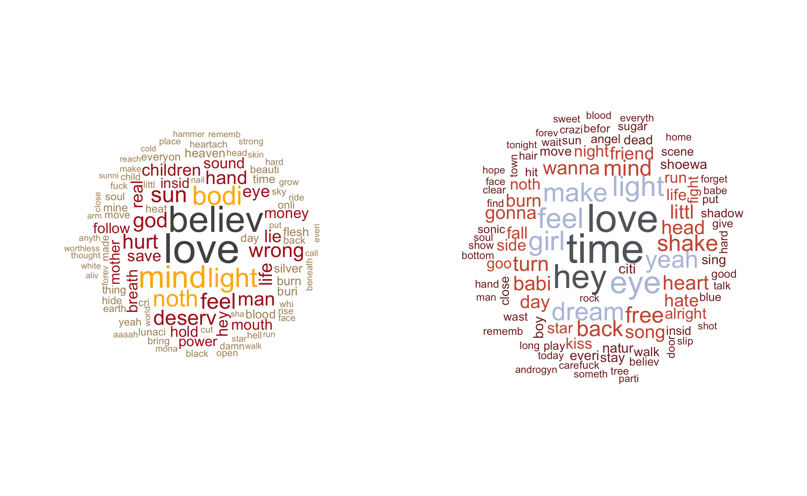

  

Time! Believe! Hey! And * drum rolls * __Love__! Music that sounds like a sledgehammer at times is no excuse to avoid the big L. It's astonishing how different the two clouds look, pointing to their distinct vocabulary. Plus, many of the words instantly trigger an [__Ohrwurm__](https://en.wiktionary.org/wiki/Ohrwurm).
 
Now let's have a look at how often they use __frequent words they have in common__ and in how many songs they use them. The most used word of each band and the word that occur in most songs are labeled.

  

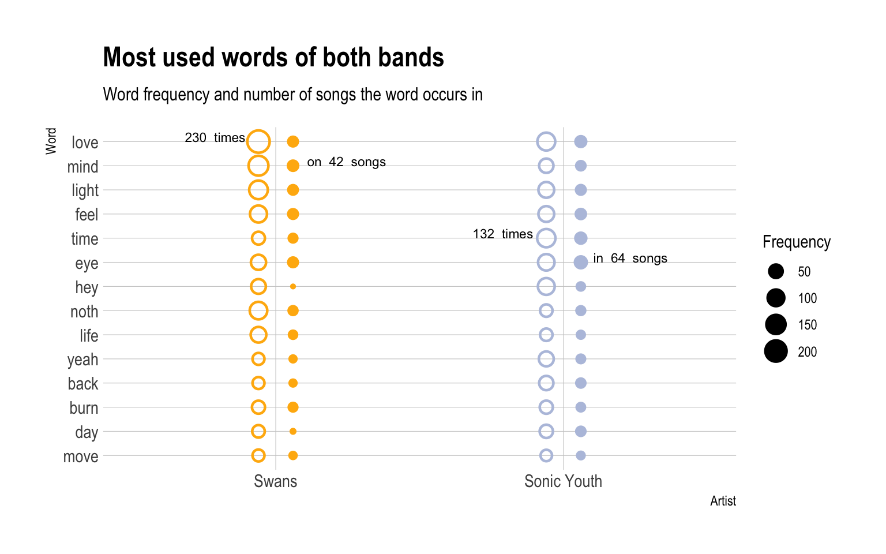

  

230 times __love!__ In a mere 36 Swans songs. Sonic Youth doesn't use it as often but in 49 songs. This trophy of repetitiveness goes to Swans! Sonic Youth, on the other hand, uses the word _eye_ in almost half of their songs.

   

|          ***And love will save you***
|          ***From the truth when you think you're free***
|          ***And love will save you***
|          ***From the cold light of boring reality***
|          ***And love will save you***
|          ***From the corruption of your lazy-minded soul***
|          ***And love will save you***
|          ***From your selfish and distorted goals***
|          (From the Swans song [*Love will save you*)](https://www.youtube.com/watch?v=HXbcErP-Xok)

   

Below you see __words that occur often alongside or close to each other__. The darker the connecting line, the stronger their link. Swans on the left, Sonic Youth on the right.

  

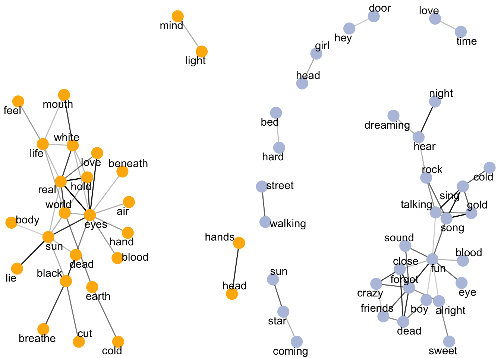

  

A lot of Swans' words cluster heavily together. In fact, I had to filter Swans' lyrics quite a lot to make it easier to look at. Sonic Youth has a lot of "island" word co-occurrences, indicating that they often use these words together but rarely with other words (e.g. _walking_ and _street_, _sun_, _star_ and _coming_).

[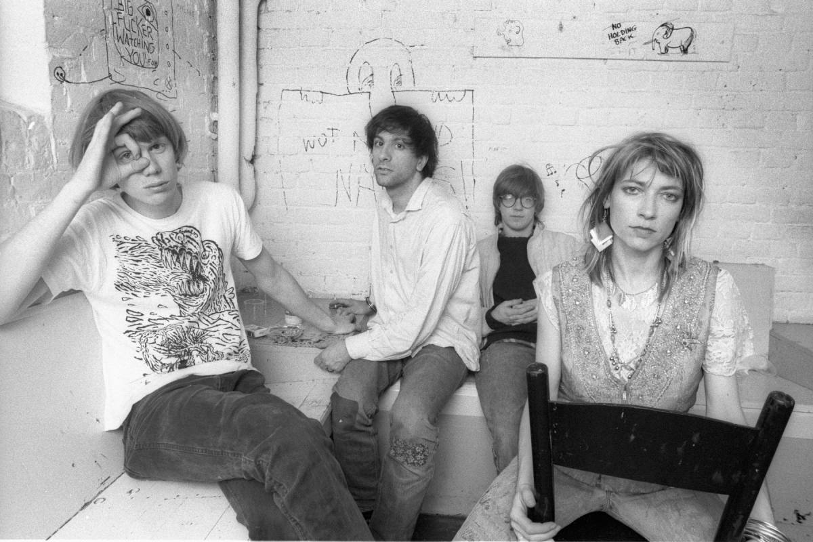](https://www.rollingstone.com/music/music-news/hot-band-sonic-youth-45573/)

### Mantras of noise: How repetitive are their lyrics?
So, coming back to the title of this little lyrics exploration, __Repetition and Noise__, how repetitive are their lyrics actually? 

Here's a plot of the two bands' lexical variety - measured as the [ratio between how many different words they use and how often they use each of these words](https://dictionary.apa.org/type-token-ratio) - of each of their records over time with the most and least repetitive record of both bands annotated.

  

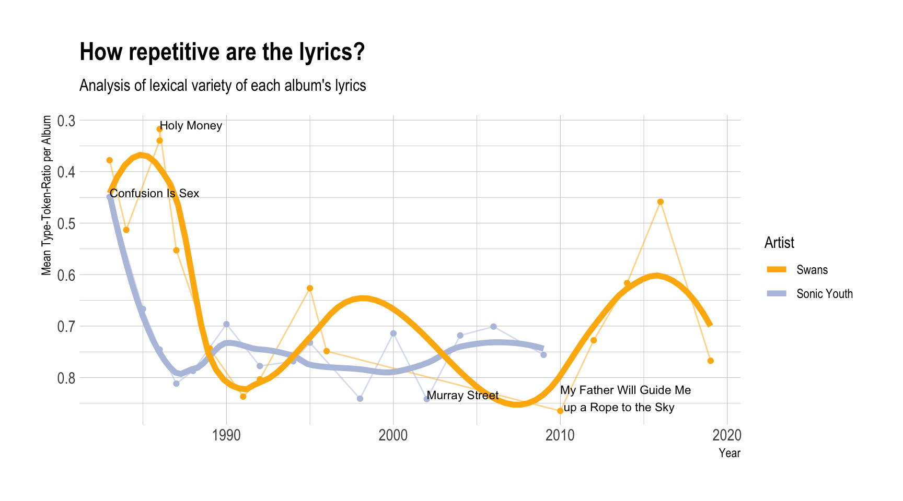

  

__Spännande!__ Both bands started VERY repetitive and then reached a plateau of absolute non-repetitiveness (a value close to one suggests no repetition!). Only Swans had a little detour into repetition-land after 2010 with their records "To be Kind" and "The Glowing Man" (but, note again, those are the records we didn't get all the lyrics for). 

 
 

|          ***Shake, shake***
|          ***Shake, shake***
|          ***Shake, shake***
|          ***Shake, shake***
|          ***Shake, shake***
|          ***Shake, shake***
|          ***Shake, shake***
|          ***Shake, shake***
|          ***Shake, shake***
|          ***Shake, shake***
|          ***Shake, shake***
|          ***Shake, shake***
|          ***Shake, shake***
|          ***Shake, shake***
|          ***Shake, shake***
|          ***Shake, shake***
|          ***Shake, shake***
|          ***Shake, shake***
|          ***Shake, shake***
|          From the Sonic Youth song [*Shaking Hell*](https://www.youtube.com/watch?v=vB_RQkSWxug)

 
 

Both bands had their first notable successes in the early 90s, after continually becoming less and less repetitive. Apparently, repetitive lyrics weren't valued that much then (note that this pattern largely follows [a general trend observed in popular music.](https://www.popnalysis.com/blog/lyrics-over-time/))

A lil' __technical note__: Type-Token-Ratio (TTR) is a crude measure and not always the optimal way to measure lexical variety, because longer texts tend to repeat words more often, thereby decreasing the TTR. However, both bands' lyrics are comparable in length per record (as seen in the plots at the top). So we can quite safely use this measure here and interpret it.

A final urging question is if their lyrics are really as negative as I usually think they are. So, let's have a look at the __sentiment__ of their words.

### All is bad bad not good: How negative are their lyrics?

Here's the two bands' __sentiment (positive or negative) per record over time__. Again, the most positive and negative records of both bands are annotated.

  

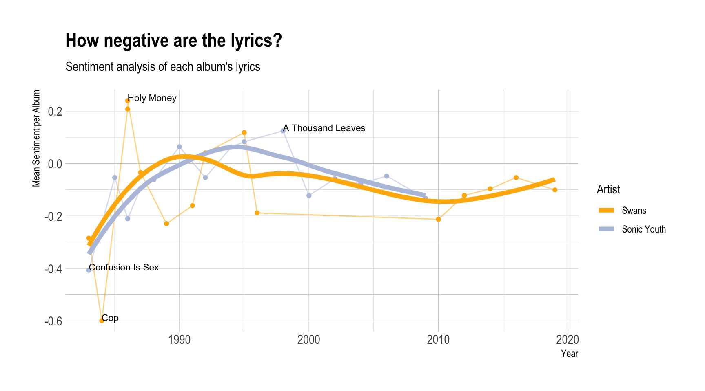

  

Well, as expected, Swans is extreme to both ends. The very negative "Cop" and the very positive "Holy Money" mark the extremes of this plot. Interestingly, both Swans and Sonic Youth started negative and over the years reached a plateau of almost neutral lyrics. Again, one could speculate whether somewhat positive lyrics were necessary for them to reach their first successes in the early 90s, or, vice versa, if success setting in calmed their troubled souls and they cheered up a bit (Note to self: This might be a nice little future project!)

__However__, if you know the Swans record "Holy Money", you certainly protest now and type an angry email telling me that this is certainly ___not___ a positive record. I agree. This nicely illustrates the shortcomings of this type of sentiment analysis.
 
 

|          ***I love you, I love you***
|          ***I love you, I love you***
|          ***I'm worthless, I'm worthless***
|          ***I'm worthless, I'm worthless***
|          ***I love you, I'm worthless***
|          From the Swans song [*Coward*](https://www.youtube.com/watch?v=OOTSm8j_pvY)
 
 
Love seems to be attached with a very positive notion and if the context is disregarded, you're told this is a feel-good summer hit. Well...

Lastly, I wanted to know whether we can __teach the computer to differentiate between the lyrics of Swans and Sonic Youth__.

### Computer says no: Is it from Swans or Sonic Youth?
Long story short: I trained several models and, as expected, they overfitted. Always. I tried everything from recursive partitioning over xgboost to random forests, using DFMs, TF-IDFs, shingles, etc. It's certainly not sufficient data to train a reliable model, since we either use each _line of lyrics_ and end up with a lot of very uninformative lines (such as "yeah yeah yeah"), or use _each song's entire lyrics_ and end up with just a few hundred training sets.

Yet, a __tensorflow__ model with six layers using __word embeddings__ worked not only very fast but also reached almost __80 percent accuracy on the unseen test set__.

And because we're here for the fun of it, we can feed the model random sentences or fragments of sentences and it will return how likely this is from Sonic Youth or Swans. For example, if we feed it the sentence ["I am so happy because today I found my friends"](https://www.youtube.com/watch?v=pkcJEvMcnEg) it says it sounds very much like Sonic Youth. No surprises here.

  

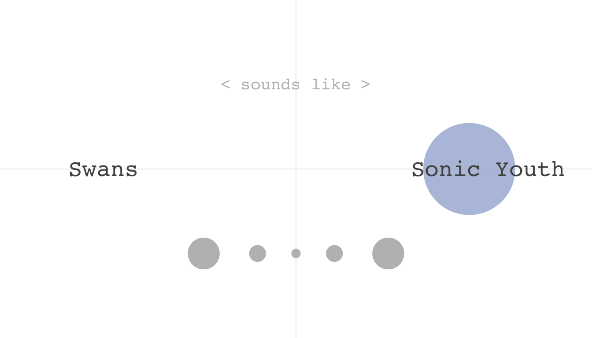

  

The sentence ["I'll kiss your shadow in the sand"](https://www.youtube.com/watch?v=c43TR7D9bos), on the other hand, sounds very much like Swans. Good job! It's a line from Swans singer Michael Gira's solo project, after all.

  

  

And since tensorflow models are super easy to put into production, I built a little [__shiny app__ ](https://dmnkfr.shinyapps.io/Swans_Sonic_Youth/) that allows you to __check whether your own lyrics (or poems or thoughts or confessions) sound more like Swans or more like Sonic Youth.__ [Try it youself!](https://dmnkfr.shinyapps.io/Swans_Sonic_Youth/)

  